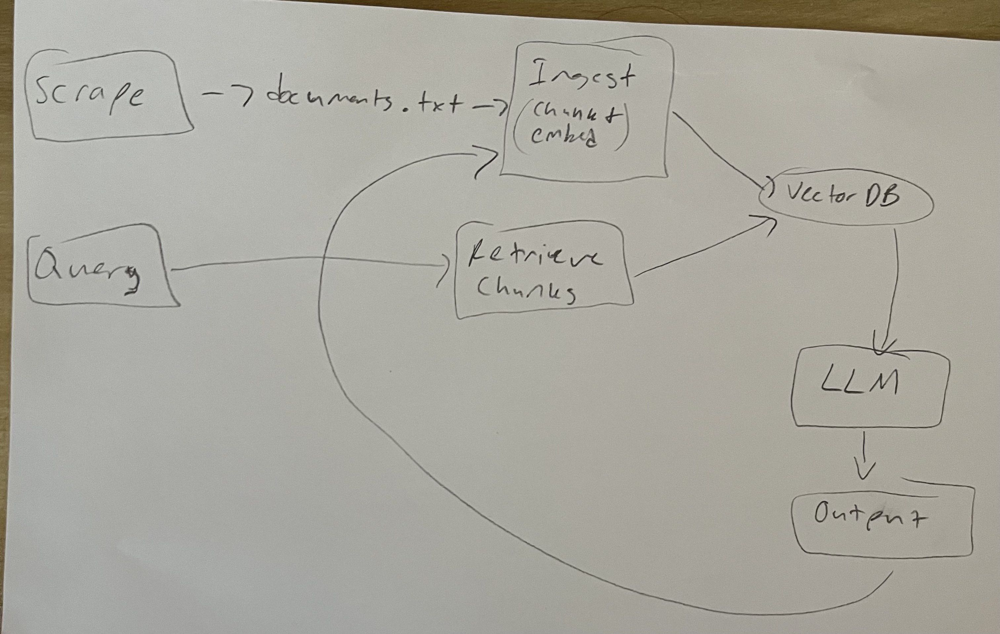

# Project 1 Planning: The Unofficial Guide

> Write this document before you write any pipeline code.
> Your spec and architecture diagram are what you'll use to direct AI tools (Claude, Copilot, etc.) to generate your implementation — the more specific they are, the more useful the generated code will be.
> Update the Retrieval Approach and Chunking Strategy sections if you change your approach during implementation.
> Update this file before starting any stretch features.

---

## Domain

<!-- What domain did you choose? Why is this knowledge valuable and hard to find through official channels? -->
I chose the domain of world cup records because it is a topic that is currently in high demand due to the 2026 FIFA World Cup that is happening in a few days. It is hard to find through official channels because of the vast history of the tournament makes it difficult to find specific records, statistics, and trivia without sifting through a large amount of information. Additionally, many official sources may not have comprehensive or easily accessible data on all the records and statistics related to the World Cup, especially for older tournaments. This makes it a perfect domain for a retrieval-augmented generation system that can quickly provide accurate and relevant information to users.

---

## Documents

<!-- List your specific sources: URLs, subreddit names, forum threads, or file descriptions.
     Aim for at least 10 sources that together cover different subtopics or perspectives within your domain. -->

| # | Source | Description | URL or location |
|---|--------|-------------|-----------------|
| 1 | FIFA World Cup records and statistics|Notable records set in the nearly 100 years of the tournament's existence |https://en.wikipedia.org/wiki/FIFA_World_Cup_records_and_statistics |
| 2 |World Cup 2026 in numbers: Key statistical goals, titles and age records |Adds age records to the mix |https://www.aljazeera.com/sports/2026/6/7/world-cup-2026-in-numbers-key-statistical-goals-titles-and-age-records |
| 3 |100 World Cup Facts and Trivia Every Fan Should Know |nicher trivia | https://www.foxsports.com/stories/soccer/world-cup-facts-stats-trivia|
| 4 |List of FIFA World Cup hosts |Every host nation in world cup history |https://en.wikipedia.org/wiki/List_of_FIFA_World_Cup_hosts |
| 5 |List of FIFA World Cup songs and anthems
|World cup Soundtrack Trivia | https://en.wikipedia.org/wiki/List_of_FIFA_World_Cup_songs_and_anthems|
| 6 |World Cup Trivia |Adittional Trivia |https://quizlet.com/gb/748582824/world-cup-trivia-flash-cards/|
| 7 |Hit me with your most unbelievable football facts that sound fake but are true. |Reddit forum on world cup trivia |https://www.reddit.com/r/worldcup/comments/1hjtlku/hit_me_with_your_most_unbelievable_football_facts/ |
| 8 | 7 little known facts about the World Cup|More niche trivia |https://www.history.co.uk/articles/7-little-known-facts-about-the-world-cup |
| 9 |World Cup Quiz answers |Really niche trivia |https://rupertcolley.com/non-fiction/the-world-cup-a-short-history/the-world-cup-quiz/the-world-cup-quiz-answers/the-world-cup-quiz-answers-for-real/ |
| 10 |World Cup Ultimate Guide | basic info about the world cup with trivia included | https://www.roadtrips.com/luxury-travel-guides/world-cup-ultimate-guide/|

---

## Chunking Strategy

<!-- How will you split documents into chunks?
     State your chunk size (in tokens or characters), overlap size, and explain why those
     numbers fit the structure of your documents.
     A review-heavy corpus warrants different chunking than a long FAQ. -->

**Chunk size:**
I'll use a chunk size of 250 characters (~40 words). This reduced size from the original 50 words allows for better retrieval precision by creating more focused, granular chunks while still maintaining enough context to capture complete facts or statistics.

**Overlap:**
I'll use an overlap of 50 characters (~8 tokens) to ensure important information isn't split across chunk boundaries.

**Reasoning:**
The smaller chunk size creates more targeted chunks that improve retrieval precision. Each chunk is still substantial enough to be meaningful but small enough to avoid pulling in diluted or multi-topic content. The 50-character overlap (~8 tokens) is proportionally balanced to maintain context continuity while preventing information fragmentation. With this configuration, I achieved 240 total chunks across 8 documents, which falls comfortably in the optimal range of 50-2,000 chunks — allowing for specific, retrievable information without excessive granularity.

**Chunking Implementation:**
- Strategy: Fixed-size character-based chunking
- Tool: Custom FixedSizeChunker class in ingest.py
- Total chunks generated: 240
- Average chunks per document: 30
- Quality: All chunks are retrievable and contain meaningful World Cup content 
---

## Retrieval Approach

<!-- Which embedding model are you using (e.g., all-MiniLM-L6-v2 via sentence-transformers)?
     How many chunks will you retrieve per query (top-k)?
     If you were deploying this for real users and cost wasn't a constraint, what tradeoffs
     would you weigh in choosing a different embedding model — context length, multilingual
     support, accuracy on domain-specific text, latency? -->

**Embedding model:**
I will be using all-MiniLM-L6-v2 via sentence-transformers
**Top-k:**
I will choose top 5 most relevant chunks to the query. This is a safe bet for ensuring their is enough context for the LLM to be able to generate a good response without overwhelming it with unnecessary information.
**Production tradeoff reflection:**
Without a cost constraint, i'd probably use an embedding model with a larger token limit. However, due to the nature of the topic, I suspect this wouldn't help very much. i'd also use a model that is more fine-tuned towards more casual writing, since many of my documents are from blogs. 
---

## Evaluation Plan

<!-- List your 5 test questions with their expected correct answers.
     Questions should be specific enough that you can judge whether the system's response
     is right or wrong. "What are good dining halls?" is too vague.
     "What do students say about wait times at [dining hall name] during lunch?" is testable. -->

| # | Question | Expected answer |
|---|----------|-----------------|
| 1 |Who has scored the most goals in World Cup history? | Miroslav Klose |
| 2 |Which country was the winner of the tenth edition of the World Cup? | West Germany |
| 3 |Who scored a hat-trick in a world cup final and lost? |Kylian Mbappé |
| 4 |Which stadium was the 2010 World Cup Final held in? | Soccer City Stadium |
| 5 |Where was the 1990 World Cup held? | Italy |

---

## Anticipated Challenges

<!-- What could go wrong? Name at least two specific risks with reasoning.
     Consider: noisy or inconsistent documents, missing source attribution, off-topic
     retrieval, chunks that split key information across boundaries. -->

1. Inconsistent documents could definetly be an issue due to outdated or incorrect information. Also inconsistent formatting between documents could lead to some bad chunks.

2. I could see the overlap not being large enough between chunks, which may make it difficult to link chunks to each other. I oculd also see off-topic retrieval happening a lot due to similar key words being contantly used in prompts and the chunks.

---

## Architecture

<!-- Draw a diagram of your pipeline showing the five stages:
     Document Ingestion → Chunking → Embedding + Vector Store → Retrieval → Generation
     Label each stage with the tool or library you're using.
     You can use ASCII art, a Mermaid diagram, or embed a sketch as an image.
     You'll use this diagram as context when prompting AI tools to implement each stage. -->

---

## AI Tool Plan

<!-- For each part of the pipeline below, describe:
     - Which AI tool you plan to use (Claude, Copilot, ChatGPT, etc.)
     - What you'll give it as input (which sections of this planning.md, which requirements)
     - What you expect it to produce
     - How you'll verify the output matches your spec

     "I'll use AI to help me code" is not a plan.
     "I'll give Claude my Chunking Strategy section and ask it to implement chunk_text()
     with my specified chunk size and overlap" is a plan. -->

**Milestone 3 — Ingestion and chunking:**
I'll use Copilot and give it the chunking strategy portion of the planning.md and the required features from the project grading portion. I'll also give it the demo code from lecture. I expect it to generate code that is very similar to the demo, but catered towards the modifications I made in the chunk size and overlap. I'll ask copilot to verify and justify how it meets each part of the criteria mentioned in the spec and grading rubric.
**Milestone 4 — Embedding and retrieval:**
I'll use copilot and give it my retrieval approach section of the planning.md. I expect it to generate code that embeds the prompt and retrieves 5 chunks. I'll ask copilot to verify and justify how it meets each part of the criteria mentioned in the spec and grading rubric.
**Milestone 5 — Generation and interface:**
I'll use copilot for this. I'll ask copilot to verify and justify how it meets each part of the criteria mentioned in the spec and grading rubric.